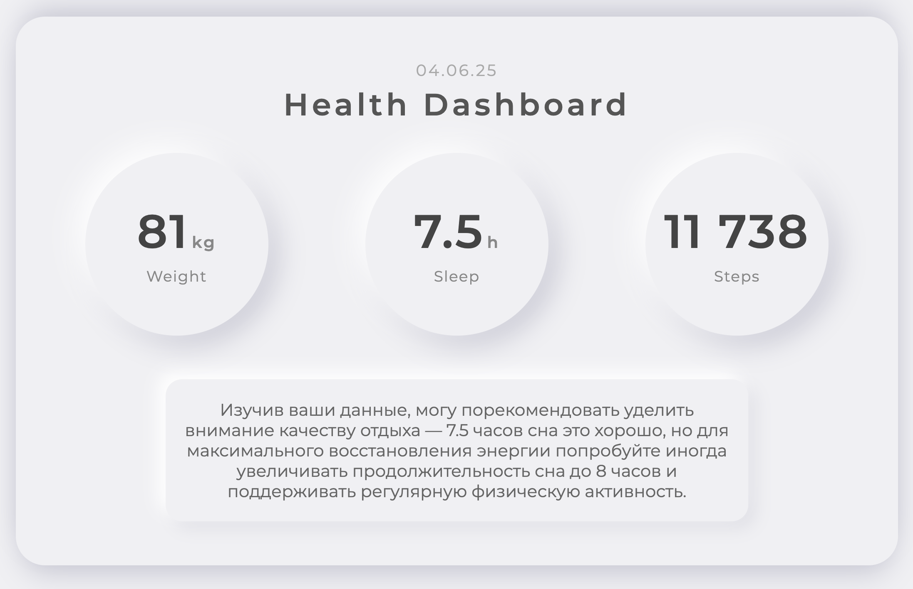

# Health_idea

A simple Flask-based web application demonstrating secure webhook handling with environment-based secret management.

## Overview

This project provides a minimal example of how to securely handle webhook requests in a Python web application. All sensitive keys (API keys, secret keys, webhook secrets) are stored in a `.env` file and loaded at runtime, ensuring they are never committed to version control.

## Features
- Flask web server
- Webhook endpoint (`/webhook`) that checks for a secret header
- Uses environment variables for all secrets (via `.env` and `python-dotenv`)
- `.env` is excluded from git via `.gitignore`

## Quick Start

1. **Clone the repository:**
   ```sh
   git clone https://github.com/zaharenok/health_idea.git
   cd health_idea
   ```
2. **Create a `.env` file in the project root:**
   Create a `.env` file in the project root and add your own unique values for:

- SECRET_KEY
- API_KEY
- WEBHOOK_SECRET

Example:
```env
SECRET_KEY=your_own_secret_key
API_KEY=your_own_api_key
WEBHOOK_SECRET=your_own_webhook_secret
```

**Never share your real secrets or commit them to version control.**
3. **Install dependencies:**
   ```sh
   pip install -r requirements.txt
   ```
4. **Run the server:**
   ```sh
   python webhook.py
   ```

## Webhook Usage
- Endpoint: `POST /webhook`
- Required header: `X-Webhook-Secret` (must match `WEBHOOK_SECRET` from `.env`)
- Request body: JSON
- Returns: JSON confirmation and echoes received data

## Security Best Practices
- Never commit your `.env` file or real secrets to git.
- Always use unique, strong secrets for all keys.
- Rotate secrets regularly if exposed.

## License
This project is provided as-is for educational purposes.
